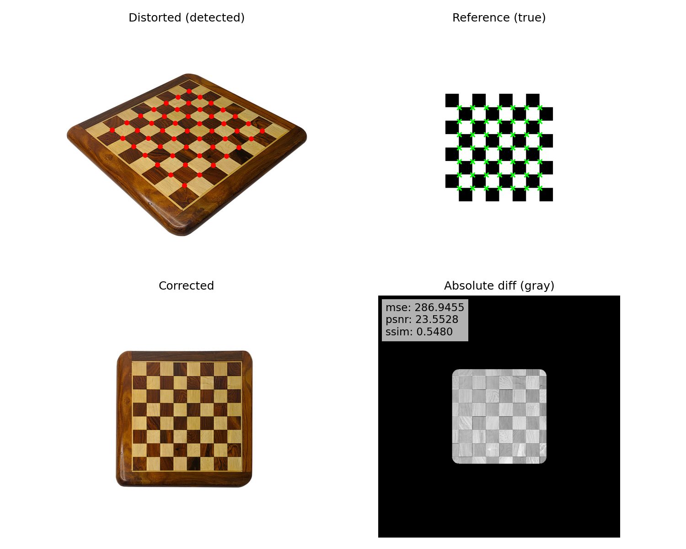

# checkerboard-rectify

Finds a chessboard in a photo, estimates an affine or homography transform, rectifies the image and reports MSE, PSNR and SSIM. Works on synthetic boards and on real photos with wood texture, glare and perspective.



## Features
- Inner-corner detection (OpenCV SB/corners fallback)
- Global point matching (Hungarian or greedy)
- Model selection: affine vs homography, with optional LM refinement
- Warp without trimming outer rows; border is preserved
- Metrics (board-only): MSE/PSNR/SSIM with photometric normalization, optional blur and downscale
- Binary “idealized pattern” metrics: accuracy/IoU inside the board area
- Side-by-side visualization (distorted, reference, corrected, absolute difference)
- Tunable through a single `config.yaml`

## Quickstart

### 1) Install
```bash
pip install -r requirements.txt
```

### 2) Run on your image
```bash
python run_demo.py --input test.jpg --pattern 7x7
```

This produces `demo_result.png` and prints metrics to the console. The visualization shows:
- top-left: distorted + detected inner corners
- top-right: reference + true corners
- bottom-left: corrected image
- bottom-right: absolute difference (masked by the board)

## Configuration

All important knobs live in `config.yaml`.

```yaml
ssim:
  blur_sigma: 2.0            # Gaussian blur to suppress wood texture
  cell_frac: 0.32            # side fraction of per-cell center region (0.28–0.36 typical)
  use_downscale: true        # optionally compute SSIM at a lower resolution
  downscale_factor: 0.75     # 0.6–0.8 can improve robustness vs texture
  photometric: true          # enable photometric alignment before SSIM
  photometric_method: "linear"  # "linear" or "histogram"

visual:
  pad: 80                    # uniform padding before detection/warp
  dpi: 150                   # save DPI for the 2x2 visualization figure

pattern:
  size: "7x7"               # inner-corner grid size (cols x rows)

binary:
  enable: true
  save: false
  out_path: "ideal_binary.png"
```

How these options affect metrics:
- Larger `blur_sigma` and moderate `downscale_factor` tend to increase SSIM by suppressing high-frequency wood texture that is absent in the synthetic reference.
- `cell_frac` defines how much of each cell’s center is used for SSIM; focusing on centers (0.28–0.34) avoids wooden borders and seams.
- `photometric_method` aligns intensity distributions inside the board mask; `histogram` is stronger but slightly slower.

## Usage Notes

- CLI flags are kept for convenience (`--input`, `--pattern`), but configuration from `config.yaml` takes precedence where relevant.
- The pipeline never crops the outer row of squares: the warp is estimated on inner corners only, while visualization and metrics use masks that fully cover the chessboard area.

## Metrics

Printed to stdout:
- Board-only MSE, PSNR, SSIM (with options from `config.yaml`)
- Binary pattern metrics inside the board mask: `acc` and `iou`

Interpretation tips:
- Low “full-image” SSIM is common when much of the image is white background. Trust the board-only metrics.
- On real wooden boards, SSIM is texture-sensitive. Use `blur_sigma` and `downscale_factor` to bring it closer to the synthetic reference.

## Repository Layout

- `run_demo.py`: entrypoint, I/O, configuration, visualization, metrics calls
- `calibrator/detect.py`: inner-corner detection helpers
- `calibrator/calc.py`: transforms, refinement, metrics (grayscale + binary)
- `calibrator/prep.py`: synthetic checkerboard generator
- `calibrator/visual.py`: 2x2 matplotlib visualization
- `config.yaml`: tuning parameters
- `tests/`: lightweight unit/integration checks

## Maximizing SSIM (practical recipe)

1) Start with:
   - `ssim.photometric_method: "histogram"`
   - `ssim.blur_sigma: 2.2`
   - `ssim.use_downscale: true`, `ssim.downscale_factor: 0.65`
   - `ssim.cell_frac: 0.30`
2) If still low due to strong texture or glare: increase `blur_sigma` slightly (≤ 2.5) or reduce `cell_frac` to focus more on cell centers.

## Testing

Run all tests:
```bash
pytest -q
```

## Notes

- The pipeline purposely avoids trimming the chessboard’s outer ring. Masking is used for fair metrics without altering the images.
- If you need to save the idealized binary pattern, enable the `binary.save` flag and point `binary.out_path` to a desired location (feature stub provided).


